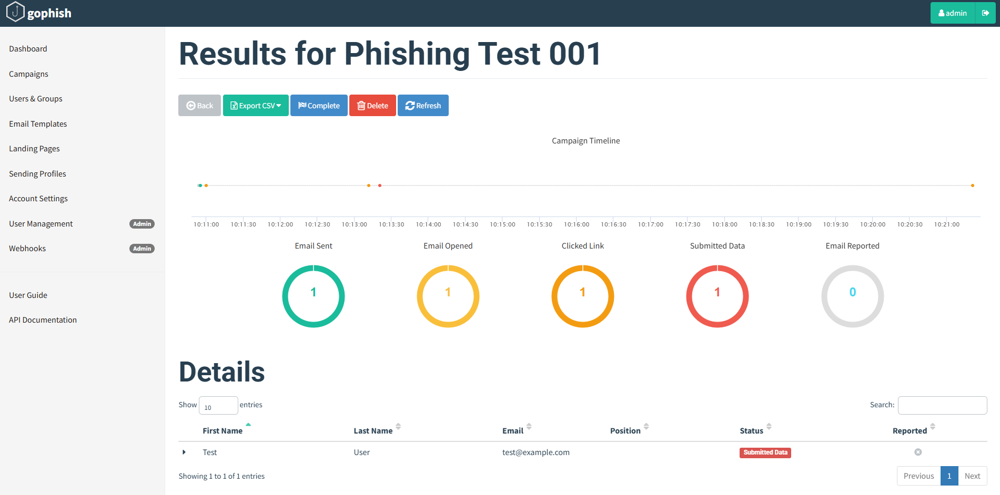

# Phishing Simulation Lab using GoPhish

## Objective
Simulate a phishing attack using GoPhish and observe how credentials are captured in a secure lab environment.

## Lab Environment
- Attacker: Kali Linux running GoPhish
- Target: Windows 11 test machine
- Email Delivery: Mailtrap (SMTP testing tool)

## Steps Performed

1. Set up GoPhish on Kali and configured the phishing server
2. Created a custom email template with a phishing link (`{{.URL}}`)
3. Created a landing page with a fake login form to capture credentials
4. Used Mailtrap to deliver phishing emails safely
5. Launched the campaign and accessed the phishing link from the Windows 11 client
6. Captured and viewed submitted credentials in the GoPhish dashboard

## Screenshots
- Phishing email in MailTrap

- Fake login page served from Kali

- Captured credentials in GoPhish

## Key Takeaways
- End-to-end phishing simulation from email to data exfiltration
- Demonstrated how attackers can socially engineer users via email
- Highlighted the importance of email filtering and user awareness

---
